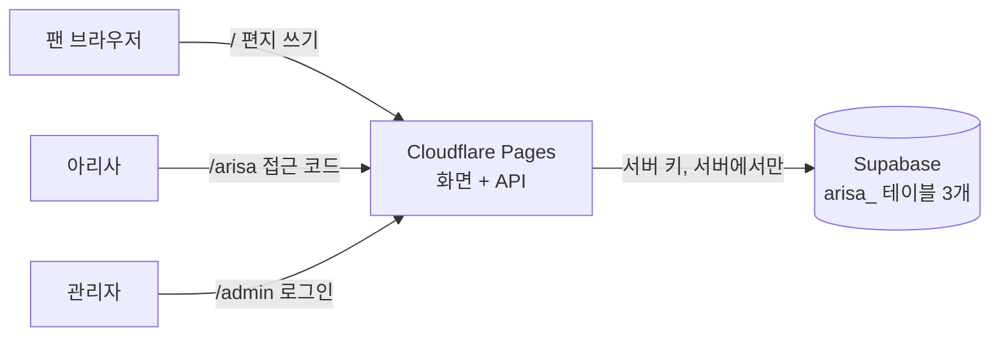

# ARISA · LAST LIVE — 아리사에게 보내는 편지

아리사의 마지막 라이브를 기념해서, 팬들이 아리사에게 편지를 보내는 작은 웹 서비스예요.
핑크빛 마법이 서서히 풀려가는 배경 위에서, 편지는 끝까지 남아요. 💌

> 기존 모카 편지 서비스와 **완전히 따로** 움직여요. 모카의 화면, 데이터, 배포는 하나도 바뀌지 않아요.

## 어떤 페이지가 있나요?

| 주소 | 누가 쓰나요? | 하는 일 |
|---|---|---|
| `/` | 팬 | 아리사에게 편지 쓰기 (이름은 비워도 돼요, 48시간에 한 통) |
| `/arisa` | 아리사 | 접근 코드를 넣고, 승인된 편지 봉투를 하나씩 열어 읽기 |
| `/admin` | 관리자 | 편지를 확인하고 승인 · 숨김 · 승인 취소 |
| `/admin/preview?letter=…` | 관리자 | 아리사가 보는 화면 그대로 미리보기 (읽음으로 기록되지 않아요) |
| `/display` | 현장 태블릿 | 편지 쓰기 QR 코드를 크게 보여 주기 (전체화면 버튼 있음) |

## 한눈에 보는 구조



- **화면**: 순수 HTML · CSS · JavaScript (빌드 과정이 없어요)
- **서버**: Cloudflare Pages Functions (`functions/`, `server/`)
- **데이터**: Supabase. `arisa_` 로 시작하는 새 테이블 3개와 함수만 써요.

> 왜 React 가 아니에요? 기획서에는 "먼저 기존 모카 구현을 확인한 뒤 정하라"고 되어 있었어요.
> 기존 모카 편지 작성 페이지가 순수 JavaScript + Cloudflare Pages 로 만들어져 있어서, 같은 방식을 쓰면
> 편지 쓰기 · 봉투 열기 모습을 그대로 가져올 수 있고 서버도 가벼워서 같은 방식으로 만들었어요.

## 내 컴퓨터에서 해 보기 (가짜 DB 로 연습)

Node.js 20 이상이 필요해요.

```powershell
npm install
npm test           # 자동 테스트 전부 통과해야 해요
npm run dev:mock   # 가짜 Supabase + 로컬 서버를 한 번에 켜요
```

`npm run dev:mock` 이 켜지면 터미널에 주소와 연습용 접근 코드·관리자 계정이 나와요.
(진짜 Supabase 에는 아무것도 보내지 않아요.)

진짜 Supabase 에 붙여서 확인하려면 [배포 가이드](docs/DEPLOYMENT.md) 를 따라 주세요.

## 폴더 안내

```text
public/            화면 (HTML, CSS, JS, 이미지)
  assets/            arisa-theme.css(핑크 테마) · emoji-layer.js(배경 이모지) · letters.js(편지 쓰기)
                     letterbox.js(아리사 편지함) · admin.js(관리자) · display.js(QR 화면)
functions/api/     Cloudflare 가 주소마다 실행하는 얇은 연결 파일
server/            진짜 서버 코드 (보안 검사, 세션, DB 호출)
supabase/migrations/  Supabase 에 한 번 실행하는 SQL
scripts/           설정 점검, 가짜 Supabase
tests/             자동 테스트
docs/              문서
```

## 문서 목록

| 문서 | 내용 |
|---|---|
| [docs/DEPLOYMENT.md](docs/DEPLOYMENT.md) | 인터넷에 올리는 순서 (Supabase → Cloudflare → QR) |
| [docs/HOW_IT_WORKS.md](docs/HOW_IT_WORKS.md) | 어떻게 움직이는지, 데이터와 보안 |
| [docs/DESIGN.md](docs/DESIGN.md) | 핑크 테마와 "Enchanted → Disenchanted" 배경 |
| [docs/phases.md](docs/phases.md) | 개발 단계(Phase 0~10) 진행 기록 |
| [docs/TEST_RESULTS.md](docs/TEST_RESULTS.md) | 테스트 결과 |
| [docs/CHANGED_FILES.md](docs/CHANGED_FILES.md) | 만든 파일 · 바꾼 파일 목록 |
| [docs/BUILD.md](docs/BUILD.md) | 처음 받은 개발 지시서 (원본) |

## 꼭 지켜야 할 약속

- 비밀키와 접근 코드는 **절대** 코드, 문서, 깃에 넣지 않아요. (`.dev.vars` 에만 있고 깃이 무시해요)
- 모카의 테이블 · 정책 · 사용자 · 데이터는 읽지도 바꾸지도 않아요.
- 승인되지 않았거나 숨긴 편지는 아리사에게 **한 글자도** 전달되지 않아요.
