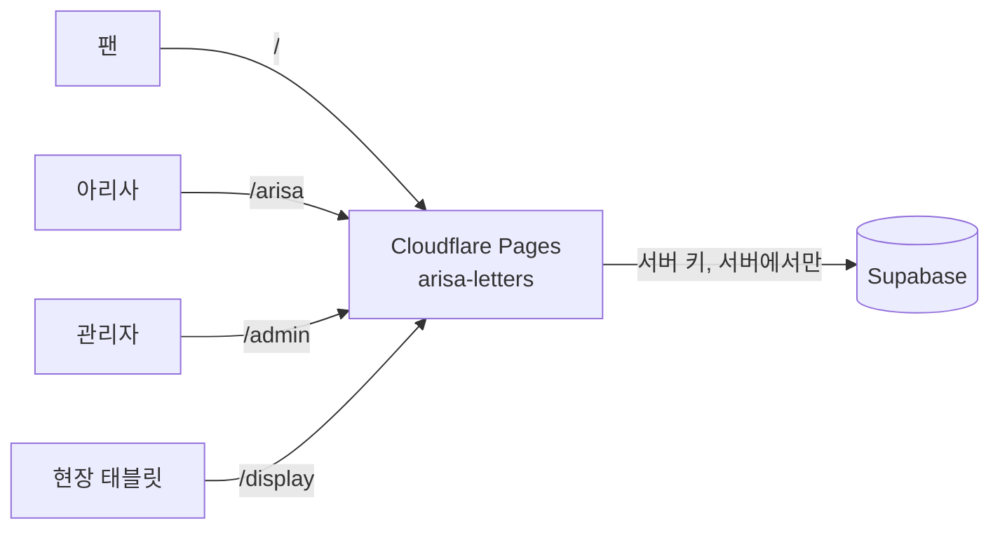

# 배포 가이드 — 아리사에게 편지 쓰기

이 문서를 위에서부터 순서대로 따라 하면 서비스를 인터넷에 올릴 수 있어요.
막히면 맨 아래 [문제 해결](#8-문제-해결)을 먼저 봐 주세요.

## 0. 전체 그림



| 부분 | 어디에 | 하는 일 |
|---|---|---|
| 화면 + API | Cloudflare Pages (이 저장소) | 화면 보여 주기, 입력 검사, 48시간 제한, 로그인 확인 |
| DB | 기존 mokano.live 가 쓰는 Supabase 프로젝트 | **새 테이블 3개 + 함수**만 추가 |

> 모카의 테이블(`fan_messages`, `moka_…`, `profiles` 등)은 읽지도, 바꾸지도 않아요.

---

## 1. 준비물

- [ ] GitHub 계정
- [ ] Cloudflare 계정 (무료 플랜이면 충분해요)
- [ ] Supabase 대시보드에 들어갈 수 있는 권한 (mokano.live 와 같은 프로젝트)
- [ ] 내 컴퓨터에 Node.js 20 이상

배포 전에 한 번 확인해요.

```powershell
npm install
npm test                 # 모두 통과해야 해요
npm run build:functions  # "Compiled Worker successfully" 가 나와야 해요
```

---

## 2. Supabase 에 테이블 만들기

1. [Supabase 대시보드](https://supabase.com/dashboard) → 프로젝트 선택
2. 왼쪽 **SQL Editor** → **New query**
3. `supabase/migrations/20261009000000_create_arisa_last_live_letters.sql` 파일 내용을 **전부** 복사해서 붙여 넣기
4. **Run** → `Success. No rows returned` 가 나오면 성공이에요.

이 SQL 이 만드는 것 (모두 `arisa_` 로 시작해요):

| 종류 | 이름 | 설명 |
|---|---|---|
| 테이블 | `arisa_last_live_letters` | 편지 본문 |
| 테이블 | `arisa_letter_submission_limits` | 48시간 제한 기록 |
| 테이블 | `arisa_letterbox_auth_attempts` | 로그인 실패 횟수 기록 |
| 함수 | `arisa_submit_letter` 등 11개 | 저장, 목록, 열람, 읽음 기록, 관리자 처리 |

여러 번 실행해도 안전해요.

### 잘 만들어졌는지 확인

```sql
select public.arisa_get_submit_status(repeat('a', 64));
```

`{"server_now_ms": ..., "next_allowed_at_ms": null}` 비슷한 결과가 나오면 성공이에요.

### 모카 데이터를 안 건드렸는지 확인 (선택)

```sql
select table_name from information_schema.tables
where table_schema = 'public' and table_name like 'arisa\_%';
```

`arisa_` 로 시작하는 테이블 3개만 나와야 해요.

### 서버 키 준비

**Project Settings → API Keys** 에서 아래 두 가지를 메모해 두세요. (다른 사람에게 보여 주면 안 돼요)

| 필요한 값 | 넣을 이름 |
|---|---|
| Project URL (`https://xxxx.supabase.co`) | `SUPABASE_URL` |
| 서버 전용 키 | `SUPABASE_SERVICE_ROLE_KEY` |

- **추천**: "Publishable and secret API keys" 탭 → **Create new secret key** → 이름을 `arisa-letters` 로 → `sb_secret_…` 복사.
  아리사 서비스 전용 키라서 문제가 생기면 이 키만 끌 수 있어요.
- 또는 "Legacy API keys" 탭의 `service_role` 키.

> ⚠️ 키와 URL 은 반드시 **같은 프로젝트**에서 가져오세요. 다르면 저장이 모두 실패해요.
> ⚠️ 이 키는 DB 전체를 열 수 있어요. 코드, 문서, 채팅, 깃에 붙여 넣지 마세요.
> 개발 지시서(`docs/BUILD.md`)에 들어 있던 실제 키는 지워 두었어요. 혹시 다른 곳에 복사해 두었다면, 새 키를 만들고 옛 키를 끄는 것을 권장해요.

---

## 3. 비밀값 3개 만들기

### 3-1. `LETTER_COOKIE_SECRET` (쿠키·세션 서명용 무작위 문자열)

```powershell
$b = New-Object byte[] 32; [Security.Cryptography.RandomNumberGenerator]::Create().GetBytes($b); [Convert]::ToBase64String($b)
```

> 한 번 정하면 바꾸지 마세요. 바꾸면 모든 팬의 48시간 기록이 초기화되고, 모든 로그인이 풀려요.

### 3-2. `ARISA_ACCESS_CODE` (아리사 편지함 접근 코드)

- 8자 이상, 남이 맞히기 어려운 글자 조합으로 정해요. 예: `k7q2-m9xd-4tzw-h8pa`
- 아리사에게 **직접** 알려 주세요. (공개 채팅에 올리지 마세요)
- 로컬 `.dev.vars` 에는 무작위 코드가 이미 만들어져 있어요. 운영에서는 같은 값을 써도 되고 새로 만들어도 돼요.
- 코드를 바꾸면 이미 열려 있던 아리사 세션이 **모두 자동으로 끊겨요.**

### 3-3. `ARISA_ADMIN_UIDS` (관리자로 허용할 사용자)

관리자는 **Supabase Auth 에 이미 있는 계정** 중, 여기에 UID 를 적어 둔 사람만 들어올 수 있어요.

1. Supabase 대시보드 → **Authentication → Users**
2. 관리자로 쓸 계정을 찾아요. (없으면 **Add user → Create new user** 로 이메일 · 비밀번호를 만들어요)
3. 그 줄의 **User UID** (`3f1c9a52-…` 모양)를 복사해요.
4. 여러 명이면 쉼표로 이어 붙여요. `uid1,uid2`

> 이메일과 비밀번호가 맞아도 UID 가 목록에 없으면 들어올 수 없어요.
> 목록에서 UID 를 지우면 이미 로그인해 있던 사람도 바로 쫓겨나요.

---

## 4. 내 컴퓨터에서 먼저 확인하기

`.dev.vars.example` 을 `.dev.vars` 로 복사하고 값을 채워요. (`.dev.vars` 는 깃이 무시해서 올라가지 않아요)

```powershell
Copy-Item .dev.vars.example .dev.vars
# .dev.vars 를 열어서 값 채우기
npm run check:config
```

`check:config` 는 비밀값을 화면에 보여 주지 않고 이렇게 알려 줘요.

| 메시지 | 뜻 |
|---|---|
| `✓ 기본 설정 형식 통과` | URL, 키, 쿠키 비밀값이 올바른 모양이에요 |
| `✓ 아리사 접근 코드 설정됨` | `/arisa` 를 열 수 있어요 |
| `✓ 허용된 관리자 UID n개 설정됨` | `/admin` 에 로그인할 수 있어요 |
| `✓ Supabase 연결 성공` | 2번 SQL 까지 끝났어요 |
| `✗ … 마이그레이션이 아직 적용되지 않았어요` | 2번을 아직 안 했어요 |

진짜 DB 로 화면까지 보고 싶으면:

```powershell
npm run dev        # http://127.0.0.1:8788
```

가짜 DB 로 연습하려면 `npm run dev:mock` 을 쓰세요.

---

## 5. Cloudflare Pages 에 올리기

### 방법 A: GitHub 연결 (추천 — push 하면 자동 배포)

1. 이 저장소를 GitHub 에 올려요. `git status` 에 `.dev.vars` 가 **보이면 멈추고** 확인하세요.
2. [Cloudflare 대시보드](https://dash.cloudflare.com) → **Workers & Pages** → **Create** → **Pages** → **Connect to Git**
3. 저장소를 고르고 아래처럼 설정해요.

   | 항목 | 값 |
   |---|---|
   | Project name | `arisa-letters` (→ `https://arisa-letters.pages.dev`) |
   | Production branch | `main` |
   | Framework preset | `None` |
   | Build command | 비워 두기 |
   | Build output directory | `public` |

4. **Save and Deploy**
5. 프로젝트 → **Settings → Variables and Secrets** → **Add** (Production), **Type: Secret**

   | 이름 | 값 | 꼭 필요? |
   |---|---|---|
   | `SUPABASE_URL` | 2번의 Project URL | ✅ |
   | `SUPABASE_SERVICE_ROLE_KEY` | 2번의 서버 전용 키 | ✅ |
   | `LETTER_COOKIE_SECRET` | 3-1 | ✅ |
   | `ARISA_ACCESS_CODE` | 3-2 | ✅ (`/arisa` 용) |
   | `ARISA_ADMIN_UIDS` | 3-3 | ✅ (`/admin` 용) |
   | `ARISA_AUTH_VERSION` | 숫자 (기본 1) | 선택 |
   | `ARISA_SESSION_HOURS` | 아리사 세션 시간 (기본 24) | 선택 |
   | `SUPABASE_ANON_KEY` | Supabase 의 공개(anon) 키 | 선택 |

6. 환경변수는 **새 배포부터** 적용돼요. **Deployments → 최신 배포 → Retry deployment**

### 방법 B: 내 컴퓨터에서 직접 올리기 (CLI)

```powershell
npx wrangler login
npx wrangler pages project create arisa-letters --production-branch main
npx wrangler pages secret put SUPABASE_URL --project-name arisa-letters
npx wrangler pages secret put SUPABASE_SERVICE_ROLE_KEY --project-name arisa-letters
npx wrangler pages secret put LETTER_COOKIE_SECRET --project-name arisa-letters
npx wrangler pages secret put ARISA_ACCESS_CODE --project-name arisa-letters
npx wrangler pages secret put ARISA_ADMIN_UIDS --project-name arisa-letters
npx wrangler pages deploy --project-name arisa-letters --branch main
```

`secret put` 은 값을 물어보면 붙여 넣고 Enter 를 눌러요. (화면에 값이 보이지 않아요)
코드를 고친 뒤에는 마지막 줄(`pages deploy`)만 다시 실행하면 돼요.

---

## 6. 올린 뒤 확인 순서

배포 주소(예: `https://arisa-letters.pages.dev`)에서 차례로 해 보세요.

**팬 편지 쓰기 (`/`)**
- [ ] 버튼이 "확인하는 중…" → "편지 보내기" 로 바뀌어요
- [ ] 이름을 비우고 `[테스트] 배포 확인` 을 보내면 "편지를 잘 받았어요." 가 나와요
- [ ] 새로고침하면 "조금만 쉬었다가 다시 써 주세요"와 남은 시간이 나와요

**관리자 (`/admin`)**
- [ ] 3-3 에서 허용한 계정으로 로그인돼요
- [ ] 방금 보낸 테스트 편지가 "대기중"으로 보여요
- [ ] **아리사 화면으로 미리보기**가 열리고, 목록의 "아리사가 읽음" 숫자는 그대로예요
- [ ] **승인하기**를 누르면 "승인됨"으로 바뀌어요

**아리사 편지함 (`/arisa`)**
- [ ] 틀린 코드는 거절되고, 맞는 코드는 들어가져요
- [ ] 승인한 편지만 봉투로 보여요 (대기·숨김 편지는 안 보여요)
- [ ] 봉투를 열면 약 1.4초 연출 뒤에 편지가 나와요
- [ ] 편지를 연 뒤에는 "✓ 읽음"으로 바뀌고, 관리자 목록에도 "아리사 읽음"이 나타나요

**현장 안내 (`/display`)**
- [ ] QR 코드를 스마트폰 카메라로 비추면 편지 쓰기 페이지가 열려요

테스트 편지 지우기 (Supabase SQL Editor):

```sql
delete from public.arisa_last_live_letters where content like '[테스트]%';
```

> 편지를 지워도 내 브라우저의 48시간 기록은 남아요. 다시 테스트하려면 다른 브라우저나 시크릿 창을 쓰세요.

---

## 7. 현장 QR 안내 화면

- 태블릿에서 `https://(내 주소)/display` 를 열고 오른쪽 아래 **전체화면**을 눌러요.
- QR 코드는 **그 화면을 연 주소의 첫 화면(`/`)** 으로 자동으로 만들어져요. 코드에 주소가 적혀 있지 않아서, 도메인을 바꿔도 따로 고칠 일이 없어요.
- 편지 쓰기 주소가 `/display` 주소와 **다를 때만** `public/display.html` 의 이 줄에 주소를 적어요.

  ```html
  <meta name="arisa-write-url" content="https://편지쓰기-주소/" />
  ```
- iPhone 처럼 전체화면을 지원하지 않는 기기에서는 전체화면 버튼이 숨겨져요.
- 지원하는 태블릿에서는 화면이 꺼지지 않게 해 줘요.
- 현장에서 쓰기 전에 **스마트폰으로 QR 을 직접 찍어서** 편지 쓰기 페이지가 열리는지 꼭 확인하세요.

### (선택) 주소를 내 도메인으로 바꾸기

1. Pages 프로젝트 → **Custom domains** → **Set up a custom domain** → 예: `arisa.example.com`
2. 안내하는 `CNAME` 을 DNS 에 추가해요. (`arisa-letters.pages.dev` 를 가리키게)
3. **Active** 가 되면 끝이에요. HTTPS 인증서는 자동이에요.

> Pages 에 먼저 도메인을 추가하고 나서 DNS 를 바꿔야 해요. 순서가 반대면 522 오류가 나요.

---

## 8. 문제 해결

| 증상 | 원인 | 해결 |
|---|---|---|
| 편지를 보내면 "편지를 받을 준비가 되지 않았어요" | 서버 설정 문제(`server_misconfigured`) | Cloudflare **Functions 로그**를 봐요. 원인이 적혀 있어요 (비밀값은 없어요) |
| 로그에 `arisa RPC not found` | 2번 SQL 을 안 했어요 | 2번 실행 |
| 로그에 `Supabase rejected SUPABASE_SERVICE_ROLE_KEY` | 키가 틀렸거나 다른 프로젝트의 키예요 | 키 다시 복사, `npm run check:config` |
| 로그에 `missing ARISA_ACCESS_CODE` | `/arisa` 설정이 없어요 | 3-2 후 새로 배포 |
| 로그에 `missing ARISA_ADMIN_UIDS` | `/admin` 설정이 없어요 | 3-3 후 새로 배포 |
| 관리자 로그인이 계속 거절돼요 | 비밀번호 오류, 또는 UID 가 허용 목록에 없어요 | 이메일·비밀번호 확인, UID 를 다시 복사 |
| "시도가 너무 많았어요" | 15분 안에 5번 틀렸어요 | 15분 기다리기. 급하면 아래 SQL |
| 관리자 로그인이 503 | Supabase Auth 가 잠시 응답하지 않아요 | 잠시 뒤 다시 시도 |
| 팬이 "쿠키를 저장하지 않아…" | 브라우저가 쿠키를 막고 있어요 | 사이트 데이터(쿠키) 허용 안내 |
| 접근 코드를 바꿨더니 아리사가 튕겼어요 | 정상이에요. 옛 세션은 자동으로 끊겨요 | 새 코드를 알려 주기 |

로그인 잠금을 바로 풀고 싶을 때 (Supabase SQL Editor):

```sql
delete from public.arisa_letterbox_auth_attempts;
```

---

## 9. 운영 중에 자주 하는 일

| 하고 싶은 일 | 방법 |
|---|---|
| 아리사 접근 코드 바꾸기 | `ARISA_ACCESS_CODE` 를 바꾸고 새로 배포 → 이전 세션 자동 종료 |
| 접근 코드는 그대로 두고 모든 세션 끊기 | `ARISA_AUTH_VERSION` 숫자를 올리고 새로 배포 |
| 관리자 추가 / 빼기 | `ARISA_ADMIN_UIDS` 수정 후 새로 배포 (빼면 바로 효과) |
| 잘못 승인한 편지 되돌리기 | `/admin` 에서 **승인 취소** (아리사 화면에서 바로 사라져요. 이미 읽은 기록은 남아요) |
| 편지 백업 | Supabase **Table Editor → arisa_last_live_letters → Export** |

---

## 10. 배포 전 마지막 점검표

- [ ] `npm test` 모두 통과
- [ ] `npm run build:functions` 성공
- [ ] `git status` 에 `.dev.vars`, `.env` 가 없어요
- [ ] 문서와 코드를 검색해도 실제 키가 없어요 (`git grep -nE "eyJ[A-Za-z0-9_-]{30,}"` 결과 없음. `npm test` 의 "비밀값" 검사도 같은 일을 해요)
- [ ] 2번 SQL 실행 완료, `npm run check:config` 에 `✓ Supabase 연결 성공`
- [ ] Cloudflare 에 비밀값 5개 입력 후 **새로 배포**
- [ ] 6번 확인 순서를 끝까지 통과
