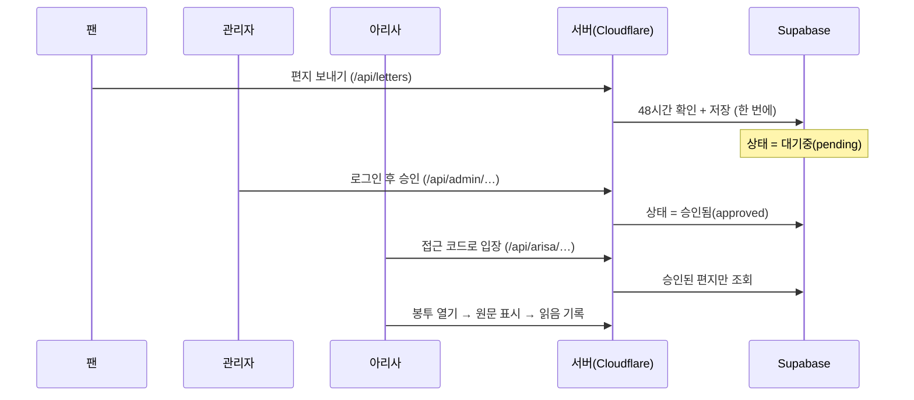

# 어떻게 움직이나요? — 기능, 데이터, 보안

## 1. 편지가 지나가는 길

편지의 상태는 3가지예요.

| 상태 | 뜻 | 아리사에게 보이나요? |
|---|---|---|
| `pending` 대기중 | 방금 도착했고 아직 검수 전 | ❌ |
| `approved` 승인됨 | 관리자가 통과시킴 | ✅ |
| `hidden` 숨김 | 관리자가 가림 | ❌ |

## 2. 팬 편지 쓰기 규칙 (`/`)

| 규칙 | 내용 |
|---|---|
| 이름 | 비우면 익명. 최대 40자 |
| 편지 길이 | **최대 2,000줄**, 전체 **256KB**(UTF-8) — 글자 수가 아니라 줄 수와 용량이에요 |
| 한 번에 한 통 | 보낸 뒤 **48시간** 지나야 다음 편지 가능 |
| 중복 방지 | 인터넷이 끊겨서 다시 눌러도 편지가 두 통 저장되지 않아요 |
| 안전한 출력 | 편지는 글자 그대로만 보여 줘요. `<script>` 를 써도 실행되지 않아요 |

### 48시간은 어떻게 지키나요?

1. 처음 방문하면 서버가 **서명된 쿠키**를 줘요. (HttpOnly라서 자바스크립트로 못 읽어요)
2. 서버는 쿠키로 만든 **해시(알아볼 수 없는 값)** 만 DB 에 저장해요. 진짜 식별자나 IP 는 저장하지 않아요.
3. 저장할 때 "마지막 편지 시각 확인 → 저장 → 다음 가능 시각 기록"을 **한 번에(원자적으로)** 처리해요.
4. 같은 요청을 다시 보내면(`idempotencyKey` 가 같으면) 새로 저장하지 않고 "이미 받았어요"만 돌려줘요.
5. 아리사의 48시간 기록은 **아리사 전용 테이블**(`arisa_letter_submission_limits`)에 따로 있어요.

> 쿠키를 지우거나 시크릿 창을 쓰면 새 사람으로 보여요. 이 제한은 "실수로 너무 많이 보내는 것"을 막는 장치이고, 악의적인 도배를 완전히 막는 장치는 아니에요.

## 3. 아리사 편지함 (`/arisa`)

- **접근 코드** 로 들어가요. 서버가 코드를 확인하고, 맞으면 **서명된 세션 쿠키**(24시간)를 줘요.
- 15분 안에 5번 틀리면 15분 동안 잠겨요. 맞는 코드도 잠금 중에는 받아 주지 않아요.
- 목록: 전체 / 아직 안 읽음 / 읽음 필터, 최신순·오래된순, 한 페이지 12통
- 데스크톱은 **2열**(왼쪽 목록, 오른쪽 열람), 모바일은 1열 + 전체 화면 열람
- 봉투 열기 → 원문 → 이전/다음 편지, `Esc` 로 닫기, 연출 건너뛰기 버튼

### 읽음 기록 규칙

- 아리사 본인 모드에서 **원문이 화면에 나온 뒤에만** 서버에 "읽었어요"를 보내요.
- DB 는 `read_at` 이 비어 있을 때만 **DB 시각**으로 한 번 적고, 그 뒤에는 바뀌지 않아요.
- 탭이 가려져 있으면(다른 탭을 보고 있으면) 기록을 미뤘다가 다시 보이면 기록해요.
- 목록을 불러오거나 편지 상세만 조회해서는 읽음이 되지 않아요.

## 4. 관리자 (`/admin`)

- 이메일 + 비밀번호로 로그인해요. 서버가 Supabase Auth 에 비밀번호를 확인해요.
- 맞아도 **`ARISA_ADMIN_UIDS` 에 적힌 UID** 가 아니면 같은 "로그인 실패"로 처리해요. (어느 쪽이 틀렸는지 알려 주지 않아요)
- 성공하면 **관리자 전용 세션 쿠키**(8시간)를 줘요. Supabase 의 access token 은 브라우저로 보내지 않아요.
- 할 수 있는 일: 목록·검색·통계, **승인 / 숨김 / 승인 취소(대기로)**, 미리보기
- 본문과 작성자는 관리자도 고칠 수 없어요. 상태만 바꿀 수 있어요.
- **미리보기는 읽음 기록 경로 자체가 없어요.** (`read_at` 을 바꾸는 호출이 관리자 코드에 없고, 미리보기 화면은 같은 브라우저의 아리사 세션도 끊어요)

### 아리사 인증과 관리자 인증은 완전히 달라요

| | 아리사 세션 | 관리자 세션 |
|---|---|---|
| 쿠키 이름 | `arisa_reader_session` | `arisa_admin_session` |
| 쿠키 경로 | `/api/arisa` | `/api/admin` |
| 서명 키 | 비밀값 + **접근 코드** 로 만든 키 | 비밀값으로 만든 **다른** 키 |
| 대상(aud) | `arisa_reader` | `arisa_admin` |
| 매 요청 확인 | 서명, 만료 | 서명, 만료, **지금도 허용 목록에 있는지** |

서로의 쿠키를 바꿔 끼워도 통과하지 못해요. (테스트로 확인했어요)

## 5. 데이터 (Supabase)

| 테이블 | 용도 | 누가 접근? |
|---|---|---|
| `arisa_last_live_letters` | 편지 (본문, 이름, 상태, 읽은 시각) | 서버(service role)만 |
| `arisa_letter_submission_limits` | 브라우저 해시별 48시간 기록 | 서버만 |
| `arisa_letterbox_auth_attempts` | 로그인 실패 횟수 (해시 키) | 서버만 |

- 세 테이블 모두 **RLS(행 수준 보안)를 켜고**, `anon` · `authenticated` 의 권한을 **모두 회수**했어요.
  → 팬이 브라우저에서 Supabase 로 직접 다른 편지를 조회할 방법이 없어요.
- 함수는 `service_role`(서버 키)만 실행할 수 있어요.
- 편지 테이블 규칙은 DB 에도 있어요: 새 편지는 항상 `pending`, 최대 2,000줄, 256KiB, 공백뿐인 내용 금지.
- 모카의 테이블은 하나도 쓰지 않아요. (자동 테스트가 SQL 에 `moka` 라는 말이 없는지 검사해요)

## 6. 서버 주소(API) 목록

| 주소 | 방법 | 누가 | 하는 일 |
|---|---|---|---|
| `/api/letters/status` | GET | 팬 | 지금 쓸 수 있는지 |
| `/api/letters` | POST | 팬 | 편지 저장 |
| `/api/arisa/session` | GET / POST / DELETE | 아리사 | 세션 확인 / 코드로 입장 / 잠그기 |
| `/api/arisa/letters` | GET | 아리사 | 승인된 편지 목록 (원문 없음) |
| `/api/arisa/letters/:id` | GET | 아리사 | 승인된 편지 한 통 |
| `/api/arisa/letters/:id/read` | POST | 아리사 | 최초 읽음 기록 |
| `/api/admin/session` | GET / POST / DELETE | 관리자 | 세션 확인 / 로그인 / 로그아웃 |
| `/api/admin/letters` | GET | 관리자 | 전체 목록 + 통계 + 검색 |
| `/api/admin/letters/:id` | GET / PATCH | 관리자 | 미리보기 / 상태 변경 |

모든 응답에는 `Cache-Control: private, no-store` 가 붙어서 편지 원문이 공용 캐시에 남지 않아요.

## 7. 보안 체크

| 위험 | 막는 방법 |
|---|---|
| 서버 키 노출 | 키는 서버 코드에서만 사용. 화면 코드에는 키 이름조차 없음(테스트로 검사) |
| 다른 사이트에서 몰래 요청(CSRF) | 쓰기 요청은 같은 사이트 `Origin` 만 허용 + 로그인 쿠키는 `SameSite=Strict` |
| 글 속 스크립트 실행(XSS) | 편지·이름은 항상 `textContent` 로만 출력. `innerHTML` 을 쓰지 않음(테스트로 검사). CSP 는 `script-src 'self'` |
| 비밀번호·코드 무차별 대입 | 15분 5회 제한(DB 에 기록). 관리자는 출처와 이메일 두 가지 기준으로 제한 |
| 미승인 편지 유출 | 아리사용 DB 함수가 `approved` 만 조회. 없는 편지와 미승인 편지는 같은 404 |
| 로그에 비밀 남김 | 로그에는 상태 코드와 오류 종류만. 원문·키·코드는 기록하지 않음(테스트로 검사) |
| 키가 다른 프로젝트 것 | 서버가 시작할 때 키의 프로젝트와 URL 을 비교해서 막음 |
| 잘못된 요청 | 허용하지 않은 필드, 너무 큰 본문(640KB 초과), 깨진 JSON 은 저장 전에 거절 |

## 8. 저장소에 저장하는 것 (브라우저)

| 이름 | 내용 | 비밀? |
|---|---|---|
| `arisa:letters:nextAllowedAt` | 서버가 알려 준 "다음에 쓸 수 있는 시각" (화면 복원용) | 아니요 |
| `arisa:letters:lang`, `…:motion` | 언어, 움직임 설정 | 아니요 |
| `arisa:letterbox:sort`, `…:motion` | 정렬, 움직임 설정 | 아니요 |
| `arisa:display:motion` | 안내 화면 움직임 설정 | 아니요 |

모두 `arisa:` 로 시작해서 다른 서비스와 섞이지 않아요. 편지 원문, 코드, 세션은 저장하지 않아요.
